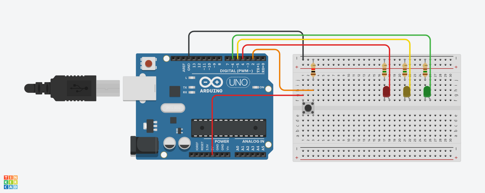

# Arduino LED Click Counter
This project uses an Arduino board to control three LEDs based on the number of clicks on a push button. The LEDs will light up in a certain pattern according to the number of clicks received by the button.

# Table of Contents
- Requirements
- Installation
- Usage
- Contributing
- License
# Requirements
To run this project, you will need the following:

1. An Arduino board (tested on Arduino Uno)
2. Three LEDs (one red, one green, and one yellow)
3. A push button
4. Jumper wires
5. Breadboard
6. Arduino IDE (or other compatible software)
# Installation
To install this project, follow these steps:

1. Clone the repository to your local machine using Git or download it as a ZIP file.
2. Connect the LEDs and push button to the Arduino board according to the wiring diagram provided in the schematic.png file. 
3. Open led-click-counter.ino file in the Arduino IDE.
4. Compile the code and upload it to the Arduino board.
# Usage
To use this project:

- Connect the Arduino board to a power source.
- Click the push button to turn on the LEDs.
- Each click will cause the LEDs to light up in a different pattern, according to the number of clicks received.
# Tinkercad
- You can view a live simulaton of the project through the following link on [Tinkercad](https://www.tinkercad.com/things/3hFKVdEEmry-led-click-counter)
# Contributing
If you'd like to contribute to this project, please follow these steps:

1. Fork the repository.
2. Create a new branch with your changes: git checkout -b my-feature-branch.
3. Commit your changes: git commit -am 'Add some feature'.
4. Push to the branch: git push origin my-feature-branch.
5. Submit a pull request.
# License
This project is licensed under the MIT License ↗. You are free to use, modify, and distribute the code as you see fit.
